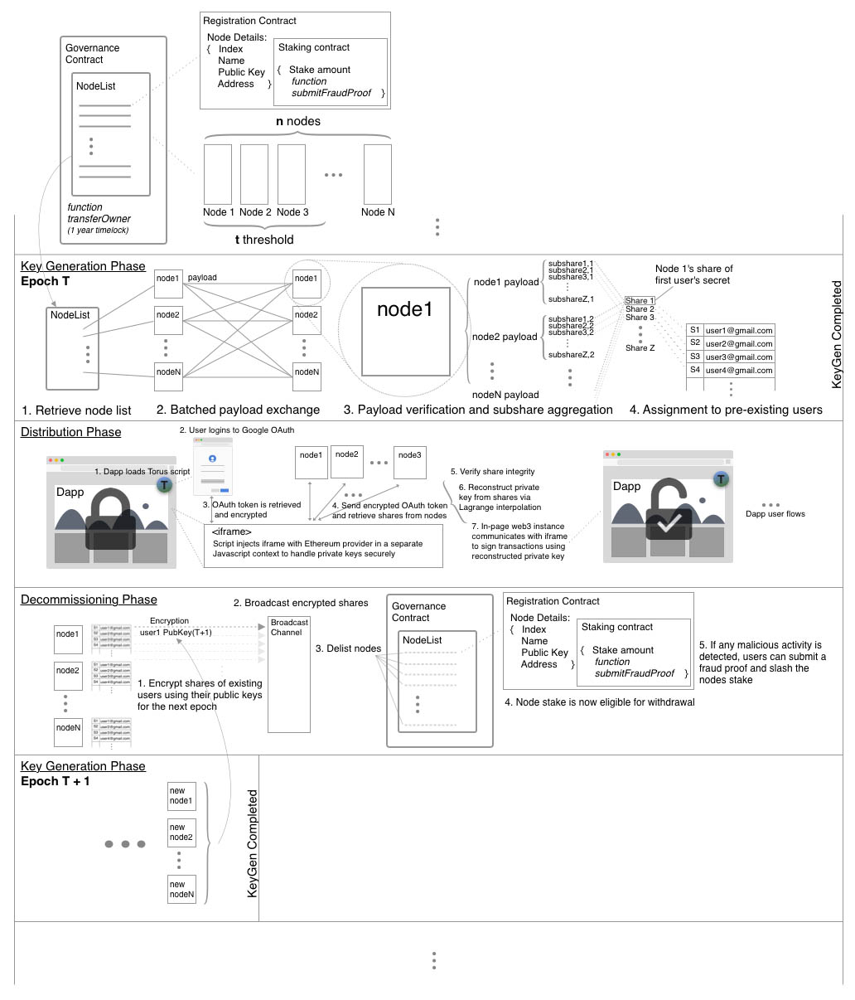

# Torus

This repo implements a Torus node. It acts as the backend for generation of private keys for Torus users in a threshold manner using publicly verifiable secret sharing (PVSS).

# Node Lifecycle

Nodes communicate between one another using Tendermint, which is used for coordination, ordering key assignments, and publishing public information.

The phases of a node's operation are as follows:
- Selection
- Key Generation
- Distribution
- Decommission

These phases are then repeated for a new selection of nodes after an epoch ends. During the selection process, nodes consult a canoncial Ethereum smart contract to retrieve public key and connection details for other nodes in their epoch. They then broadcast their intent to start the key generation phase to other nodes. Upon receiving confirmation from all other nodes, nodes start generating keys using [PVSS](https://www.win.tue.nl/~berry/papers/crypto99.pdf), and publish their public proofs to Tendermint. Nodes then verify their shares against these public proofs to ensure that they are verified, and flag discrepancies.

After nodes have generated an ordered batch of keys in this manner, they broadcast their intent to stop key generation and enter the distribution phase. During the distribution phase, nodes allow requests for key assignments, and ordering for such assignments across nodes is synchronised over Tendermint. This mapping is stored in the application state. When users request for their private key shares, they provide nodes with valid OAuth credentials, which is authenticated individually by nodes. Nodes should reject OAuth proofs that have been received before, to prevent transaction replay attacks.

When an epoch ends, nodes decommission by using [proactive secret sharing](http://pmg.csail.mit.edu/papers/mpss-thesis.pdf) (PSS) to reshare their secrets with nodes in the next epoch.

- [x] Node List Smart Contract
- [x] PVSS
- [x] Key Assignments
- [x] Intra-epoch Key Generation
- [ ] PSS
- [ ] Fraud Proofs

# Node Setup

In order to a run a node, you need to run an instance of Torus. The easiest way to do this is to use our prepared Docker image, and provide your node private key and IP address as environment variables.
