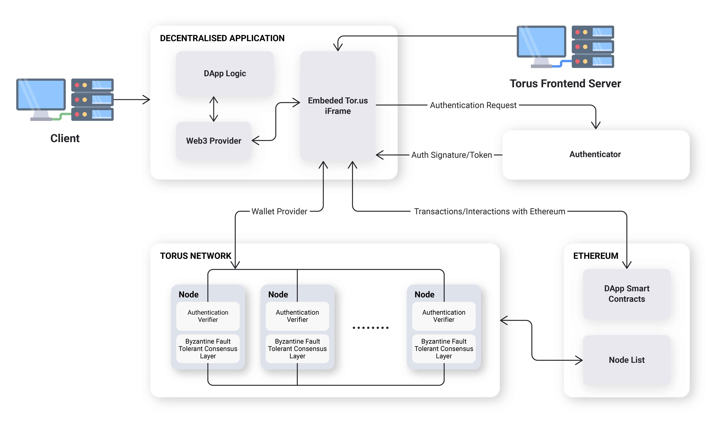

# Torus Node

This repository implements a Torus node. 

A cluster of Torus nodes form the Torus Network, which hold private key shares for Torus users. These private keys are generated via distributed key generation (DKG) and retrieved via OAuth logins (eg. Google, Reddit). For more information, read the docs [here](http://docs.tor.us).



## Architecture
Functionality within the Torus node is implemented via services, and cross-service communication happens over a central eventbus. Services can be mocked via eventbus middleware, and can also be implemented as an external process that responds to eventbus messages.

Services:
- ABCI
- Telemetry
- Ethereum
- Tendermint
- Server (JRPC)
- P2P
- Keygen
- PSS
- Mapping
- DB
- Verifier
- Cache

### General Overview <a id="general-overview"></a>

_This document serves primarily as a guide to Torus, and not as a technical specification. It may become outdated. For the latest and greatest, checkout our open-source code at_ [_https://github.com/torusresearch_](https://github.com/torusresearch/torus-website)_​‌_

The architecture consists of four parts:‌

* Nodes in charge of Distributed Key Generation \(DKG\)
* A smart contract in charge of the management of nodes
* A private BFT network between nodes
* A javascript front-end wallet client that interacts with nodes

A smart contract is used for node discovery. Nodes are selected, operate for a fixed period, and generate a set of keys via DKG.‌

When a user arrives at a DApp, the javascript client is loaded. From there, a user logs in, they provide proof that they are logged in, and the proof is verified by each node individually. This proof is integrated with the modern OAuth 2.0 Token Authentication flow. For new users, nodes will assign a new key share from the pre-generated set of key shares, and store this assignment in an internal mapping. For returning users, nodes will look up their internal mapping and return that user's corresponding key share.‌

The javascript client then assembles these shares and reconstructs the users key in the front-end. This key is kept for the session and is not persisted in localstorage.

### Torus Nodes <a id="a-node-and-its-trust-assumptions"></a>

#### Epochs

Torus nodes operate within a certain time period, called an epoch. Nodes within the same epoch are part of the same BFT network and hold key shares that are compatible with each others' key shares. Nodes within different epochs do not. The main purpose of epochs is to ensure that node operators can be removed and added, and to minimize the impact of loss of key shares or node failures over time.

#### Initialization

When a Torus node is started, the node tries to register its connection details on an Ethereum smart contract. Once all nodes have been registered for that epoch, they try to connect with each other to set up the BFT network, and start generating distributed keys. They also listen for incoming information from nodes in the previous epoch.

#### Operation <a id="operation"></a>

During operation, a Torus node runs three separate parallel process: one to map user IDs to keys, one to generate distributed key shares, and one to allow users to retrieve their shares.

The mapping process primarily interacts with the BFT layer, which allows nodes to share state on which keys belong to which users. When a new user requests for a key, the node submits a BFT transaction that modifies this state. Existing users who have logged in are compared against this shared state to ensure that they retrieve the correct key share.

The distributed key generation process primarily uses libp2p for communication between nodes, and generates a buffer of shared keys, in order to reduce the average response time for key assignments for new users.

The share retrieval process starts when a user wishes to retrieve their keys. They individually submit their OAuth token via a commit-reveal scheme to the nodes, and once this OAuth token is checked for uniqueness and validity, each node returns the user's \(encrypted\) key share. This does not require communication between the nodes.

Assignments of keys to new users only require interaction with the mapping process, assuming that there is at least one unassigned key in the buffer. As such, we are able to assign keys to accounts ahead of time, before that accounts' owner decides to login and reconstruct the key. This forms the basis for our account resolver APIs.

#### Migration

When an epoch comes to an end, the current node operators agree on the next epoch, and send information about the current mapping state and the existing keys to the next set of nodes in the next epoch. This is done via typical reliable broadcast methods for the mapping, and PSS \(proactive secret sharing\) for the key shares.

#### Trust Assumptions <a id="trust-assumptions"></a>

The Torus Network operates on two main threshold assumptions: a key generation threshold \(&gt;¼\)and a key retrieval threshold \(&gt;½\). Generating keys for new users requires more than ¾ of the nodes to be operating honestly, and reconstructing keys for existing users requires &gt;½ of the nodes to be operating honestly. For more information, refer to the dual-threshold construction in [AVSS](https://eprint.iacr.org/2002/134.pdf).

While most other secret sharing schemes use ⅔ honest majority with a &gt;⅓ reconstruction threshold, our preference for total system failure over key theft favors the former thresholds.‌

### Key Generation <a id="key-generation"></a>

Since key generation is an activity that requires several rounds of communication, it is unwise to do this whenever a user requires new keys. Instead, we generate buffers of unassigned keys ahead of time, so that we only need to assign them to users when they request for new keys.‌

We run this Distributed Key Generation \(DKG\) via a cryptographic scheme called [Asynchronous Verifiable Secret Sharing \(AVSS\) by Cachin et al. \(2002\)](https://eprint.iacr.org/2002/134.pdf). The main advantage the DKG has over the other well-known DKGs like Pedersen DKG, Feldman's VSS and its variants is that it is fully asynchronous and thus does not require a complaint phase when we consider the allowance for a small zero-knowledge proof. This results in a simpler implementation \(with constant communication rounds even during malicious scenarios\),  but at the expense of message size.

In brief, this scheme generates a random bivariate polynomial \(i.e. 2D surface\) and creates horizontal \(X\) and vertical \(Y\) slices at the appropriate indices as sharings. We then get sub-sharings \(points\) on these horizontal and vertical sharings at the appropriate indices and echo them to other nodes. As a node, the polynomial reconstructed from the sub-sharings received from other nodes should match up with the initial sharing that the node received from the dealer, and even if they do not, the node can always interpolate the correct sharing via these echoed sub-sharings. This eliminates the dealer complaint phase. We then we restrict ourselves to just the horizontal \(X\) domain such that our final sharings are still on that of a univariate polynomial, which is what a typical DKG does.‌

At the end of the distributed key generation process, the nodes are left with a \(polynomial\) share to a master polynomial. This master polynomial is the sum of all the initial polynomials which were generated by each participating node. Since a threshold number of nodes contributed to this master polynomial's randomness, it is not possible for any non-threshold subset of nodes to recover its coefficients. 

The constant coefficient of this master polynomial is the user's private key.

### Proactive Secret Sharing

The Torus network functions in epochs. Each epoch has a set of nodes that are in charge of the node operations, and when they are done, they migrate the necessary state over to the next epoch's nodes. Since our entire system does not store any state other than the mappings of TorusIDs to user IDs and private keys, the only systems needed are the ones that migrate mappings and private keys across epochs.‌

The migration of keys uses Proactive Secret Sharing \(PSS\), also from the AVSS paper. Simply copying shares across epochs is a bad idea, since a single node operator operating in two separate epochs would get access to two shares, and it also makes it not possible to increase or decrease the number of operators in each epoch.

In brief, the key idea is that we create polynomial sharings of the existing key shares and add these polynomials in a specific way such that the coefficient of the master polynomial is the Lagrange interpolation of the existing key shares. Much like how DKGs are the sum of several secret sharings, where the master secret is the sum of all of the secrets from each of the N-parallel secret sharing protocols, we can do the same thing by setting N-parallel secret sharing protocols to be run by the original set of nodes, with their "secret" as their share. The resulting shares of shares, if added appropriately \(multiply them by Lagrange coefficients first\), would lead to a re-sharing on the original secret.

### Authentication and Assignments <a id="authentication-and-assignments"></a>

#### Key Assignments <a id="key-assignments"></a>

The keys are assigned to a combination of `verifier` \(e.g., Google, Reddit, Discord\) and `verifier_id` \(e.g., email, username\), which is a unique identifier respective to and provided by the `verifier`.‌ This assignment can be triggered by any node and is decided through the nodes consensus layer.

#### Verifiers and Key Retrieval <a id="verifiers-and-key-retrieval"></a>

In order to allow for general identifiers to be used instead of only allowing OAuth, we typically need at least two of these APIs to be implemented by the external verifier:‌

1. an API that issues unique tokens when a user is logged in.
2. an API that consumes these tokens and returns user information as well as when the token was issued.

The first API must be accessible from the browser \(e.g. CORS-enabled, restricted headers\), in order to ensure that the Torus servers are not able to intercept the user's token \(front-running\).

Typically any entity that fulfills these two APIs and provides signatures on unique ID strings and timestamp can be a verifier. This is extendable to several authentication schemes, including existing authentication standards like OAuth Token flow and OpenID Connect.‌

**Front-Running Protection**

In order to prevent a rogue node, or the Torus servers, from front-running you by taking your token, impersonating your login, and thereby stealing your key, we use a commitment scheme on our token similar to Bracha's Reliable Broadcast, to ensure that all nodes can be sure that a threshold number of other nodes are aware of the commitment, before it is finally revealed.‌

The general approach is as follows: we ensure that the front-end gets access to the token first, creates a commitment to the token and a temporary public-private keypair, and reveals the token only if a threshold number of nodes accept this commitment. The nodes will then use this keypair to encrypt the shares before sending it to the user.

This is done by generating a temporary public-private keypair in the front-end. The front-end calls the first API and receives an authentication token. This token is hashed, and the front-end sends the token hash and the temporary public key to each node, and each node returns a signature on this message, if this is the first time they have seen this token commitment. A bundle of these signatures is the proof, and submitting the proof together with the plain \(unhashed token\) to each node results in the node responding with a key share that is encrypted with the temporary public key.

**Attack 1: Front-runner intercepts the original commitment request and sends a modified public key**

In this case, the user will not receive a threshold number of signatures, and thus will not reveal their token. They will then be required to login again and request for a new token. Since the requests to the nodes are made in a random order, eventually a threshold honest set can be reached before a front-runner receives the commitment request.

**Attack 2: Front-runner intercepts the reveal request and resends it to other nodes**

Since a public key is already associated with the token in the commitment request, nodes will only respond with encrypted shares. Even if a front-runner intercepts the encrypted shares, they will be unable to decrypt it.


## Updating Dependencies
To update dependencies in the repository, run:
```
./scripts/updateDeps.sh
```

This script does the following:

```
go mod tidy
go mod vendor

go get -u github.com/ethereum/go-ethereum@v1.8.20
rm -rf   vendor/github.com/ethereum/go-ethereum/crypto
cp -a $GOPATH/pkg/mod/github.com/ethereum/go-ethereum@v1.8.20/crypto vendor/github.com/ethereum/go-ethereum/crypto
chmod -R 755 vendor/github.com/ethereum/go-ethereum/crypto
```

## Linting
Use [golangci-lint](https://github.com/golangci/golangci-lint) for linting, execute:

```
golangci-lint run
```
